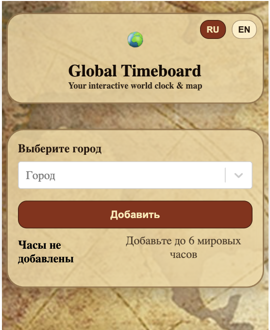
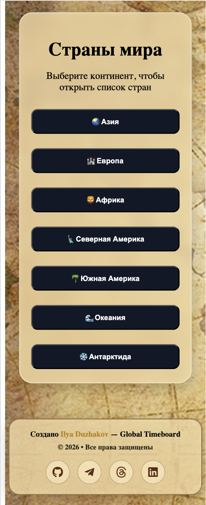
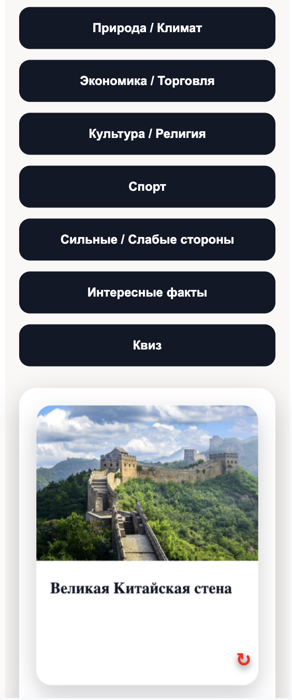
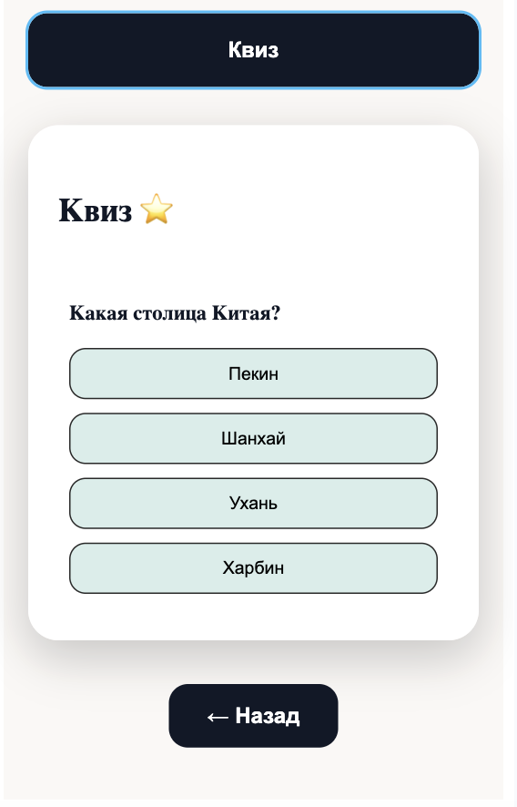

# 🌍 Global Timeboard

**Global Timeboard** is an interactive React PWA that combines world time, an SVG world map, and a country information system.

The project is built as a personal geography-focused application with a vintage atlas interface.

## Demo

🌐 Live demo: https://ilyaduzhakov.github.io/global-timeboard

---

## Screenshots

### Desktop

### Mobile

### Country Page

### Quiz

---

## Features

- World time for selected capitals
- Up to 6 analog clocks
- Real IANA timezones with daylight saving support
- Interactive SVG world map
- Country information pages
- Landmarks with images and descriptions
- Interesting facts
- Country quizzes
- Russian and English language support
- Responsive desktop, tablet, and mobile layout
- PWA support

---

## Country Information

Each country page can include:

- government system
- capital and flag
- population
- language
- currency
- natural resources
- nature and climate
- economy and trade
- culture and religion
- sports
- strengths and challenges
- landmarks
- facts
- quiz

---

## Technologies

- React
- JavaScript
- Luxon
- D3-geo
- TopoJSON
- React Select
- CSS Modules
- LocalStorage
- PWA
- GitHub Pages

---

## Project Goal

The goal of Global Timeboard is to create an interactive world atlas that combines:

- time
- geography
- education
- maps
- visual learning
- country exploration

The project is currently under active development.
New countries, cards, quizzes, screenshots, and UI improvements are being added gradually.

---

## Author

Created by **Ilya Duzhakov**.

© 2026 Global Timeboard. All rights reserved.
