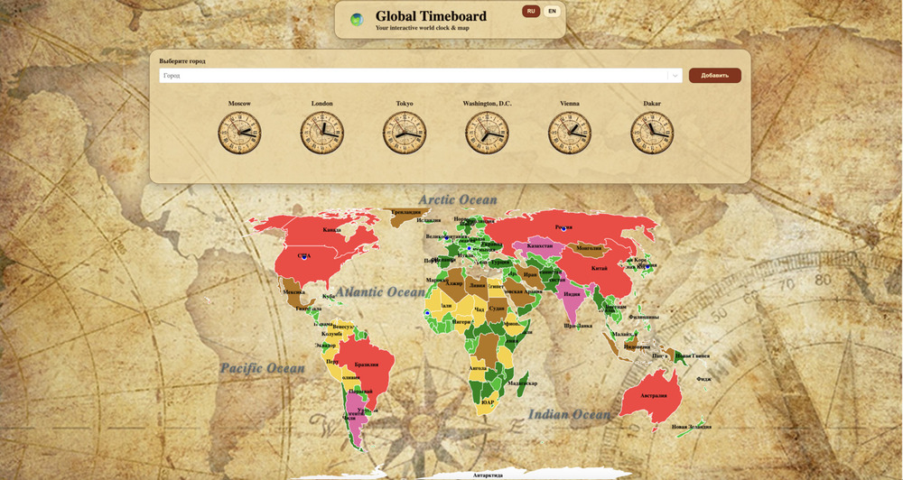
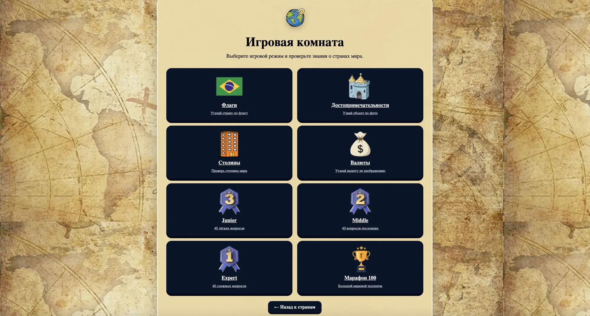
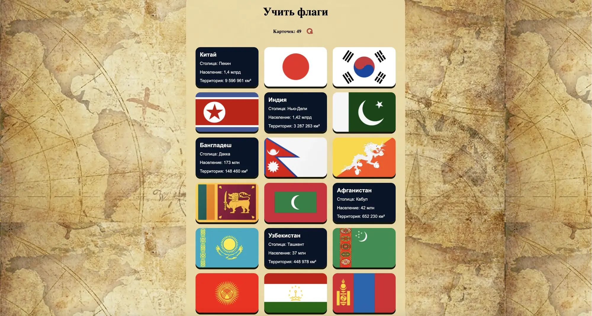
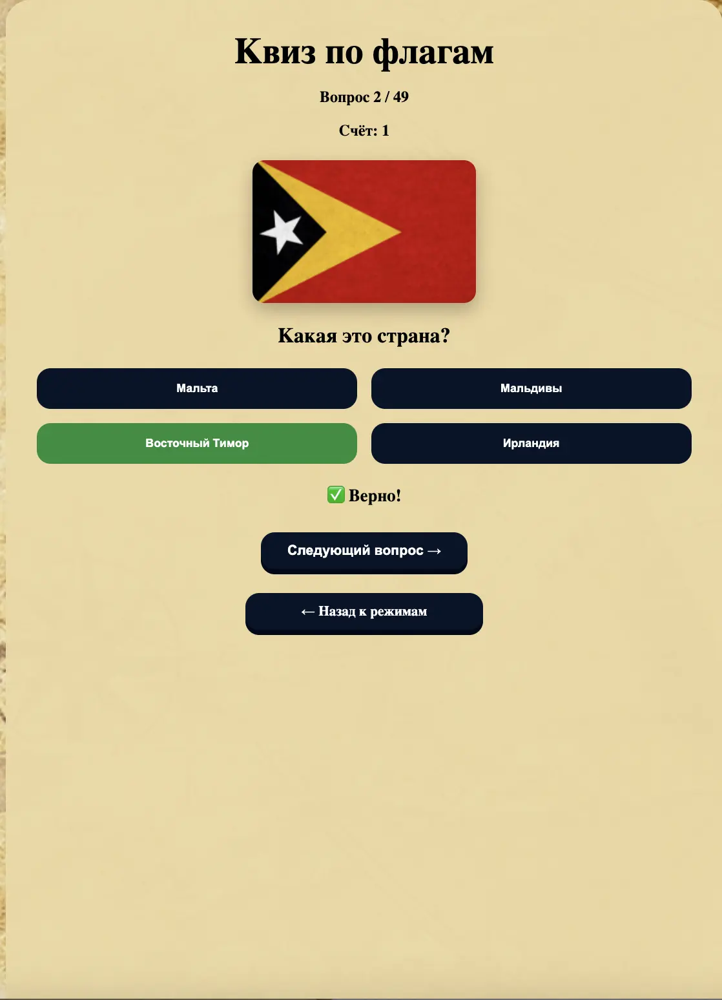
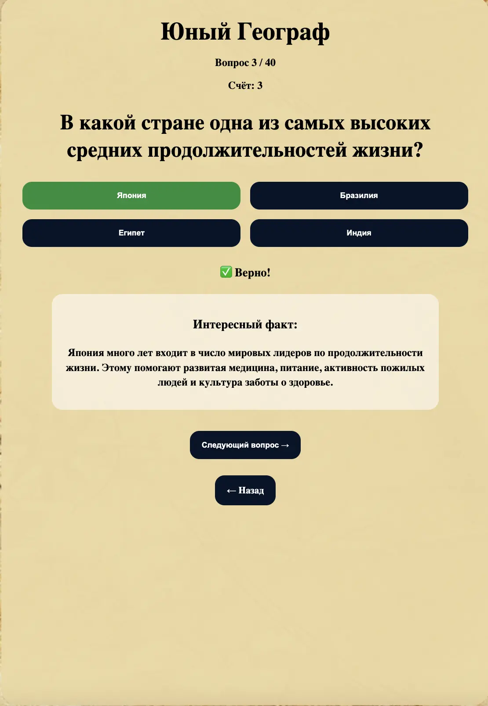

# 🌍 Global Timeboard

Interactive World Atlas • World Clocks • Geography Learning • Quizzes

**Global Timeboard** is an interactive React PWA that combines world time, an SVG world map, and a country information system.

The project is built as a personal geography-focused application with a vintage atlas interface.

## Demo

🌐 Live demo: https://ilyaduzhakov.github.io/global-timeboard

---

## Screenshots

### Desktop

### Mobile

### Country Page

### Quiz Hub

### Learn Flags

### Flag Quiz

### Junior Geography

---

## Features

- Interactive world map
- World clocks with real IANA timezones
- Country information pages
- Learn Flags mode
- Flag Quiz
- Capitals Quiz
- Junior Geography Quiz
- Educational facts after answers
- Landmarks and points of interest
- Russian and English language support
- Responsive desktop and mobile layout
- Progressive Web App (PWA)

---

## Country Information

Each country page can include:

- government system
- capital and flag
- population
- language
- currency
- natural resources
- nature and climate
- economy and trade
- culture and religion
- sports
- strengths and challenges
- landmarks
- facts
- quiz

---

## Technologies

- React
- JavaScript
- Luxon
- D3-geo
- TopoJSON
- React Select
- CSS Modules
- LocalStorage
- PWA
- GitHub Pages

---

## Project Goal

The goal of Global Timeboard is to create an interactive world atlas that combines:

- time
- geography
- education
- maps
- visual learning
- country exploration

The project is currently under active development.
New countries, cards, quizzes, screenshots, and UI improvements are being added gradually.

---

## Author

Created by **Ilya Duzhakov**.

© 2026 Global Timeboard. All rights reserved.
