# 🌍 Global Timeboard

**Global Timeboard** is an interactive world atlas built with React.

It combines world clocks, an SVG world map, country encyclopedia pages, geography quizzes, achievements, PWA installation, and offline support in a vintage atlas-style interface.

🌐 **Live demo:** https://ilyaduzhakov.github.io/global-timeboard

---

## 🎬 Demo

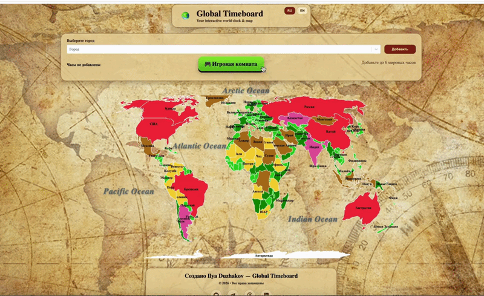

---
##  Features

###  Geography

* Interactive SVG World Map
* Country Encyclopedia
* Country Facts and Statistics
* Government Systems
* Economy and Resources
* Nature and Climate
* Culture and Traditions
* Sports and National Achievements
* Country Landmarks

###  World Time

* Multiple World Clocks
* Real IANA Time Zones
* Up to 6 Custom Clocks
* Live Time Updates

###  Quiz System

* Flag Quiz
* Capitals Quiz
* Currency Quiz
* Landmarks Quiz
* Junior Geography Quiz
* Middle Geography Quiz
* Expert Geography Quiz
* Marathon 100 Challenge
* Educational Facts After Answers

###  Progress System

* Achievement Hall
* Medals and Records
* Quiz Statistics
* Local Progress Saving

###  Modern App Features

* Progressive Web App (PWA)
* Offline Support
* Lazy Loading
* Responsive Design
* LocalStorage Persistence
* English and Russian Languages

## 📱 PWA & Offline Support

Global Timeboard is available as a Progressive Web App (PWA).

The application can be installed on desktop and mobile devices and used like a native application.

### PWA Features

* Installable on Android and iOS
* Installable on desktop browsers
* Offline support
* Service Worker caching
* Standalone application mode
* Fast repeat loading
* Responsive mobile experience

### Installation

#### Android

1. Open Global Timeboard in Chrome.
2. Tap the browser menu.
3. Select **Add to Home Screen** or **Install App**.
4. Launch Global Timeboard directly from your device home screen.

#### iPhone / iPad

1. Open Global Timeboard in Safari.
2. Tap the **Share** button.
3. Select **Add to Home Screen**.
4. Launch the application from your home screen.

### Offline Mode

When an internet connection is unavailable:

* previously cached resources remain available;
* users receive an offline notification;
* an offline page is displayed when required resources cannot be loaded.

This allows Global Timeboard to provide a smoother experience even with limited connectivity.

### 📲 Install as PWA

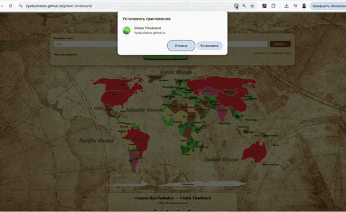

## 🎬 Application Showcase

### 🌍 Country Encyclopedia

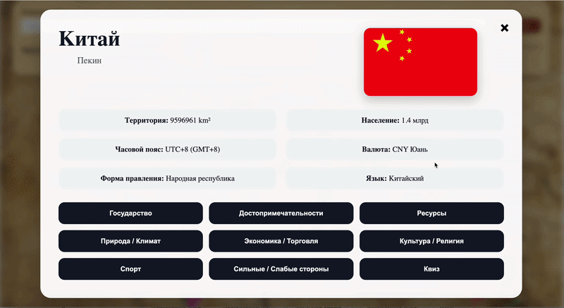

Shows:

* Country Information
* Economy
* Nature
* Culture
* Landmarks
* Facts

---

### 🚩 Geography Quizzes

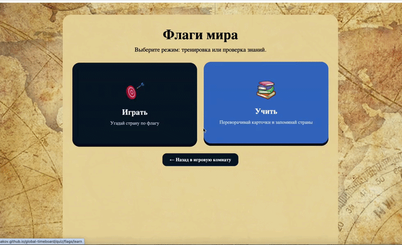

Shows:

* Flags Quiz
* Capitals Quiz
* Currency Quiz
* Landmarks Quiz

## Screenshots

### Desktop

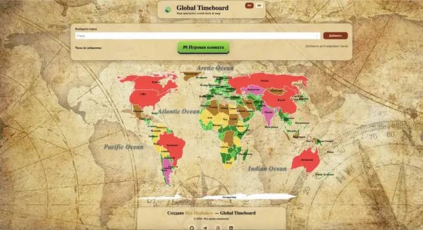
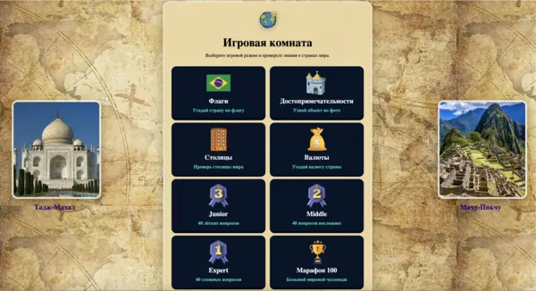

### Mobile

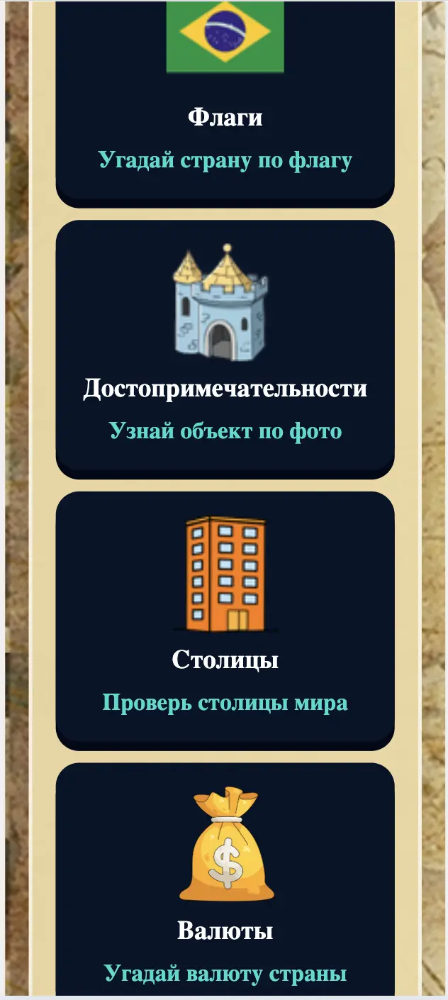
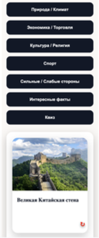

---

### New Sections

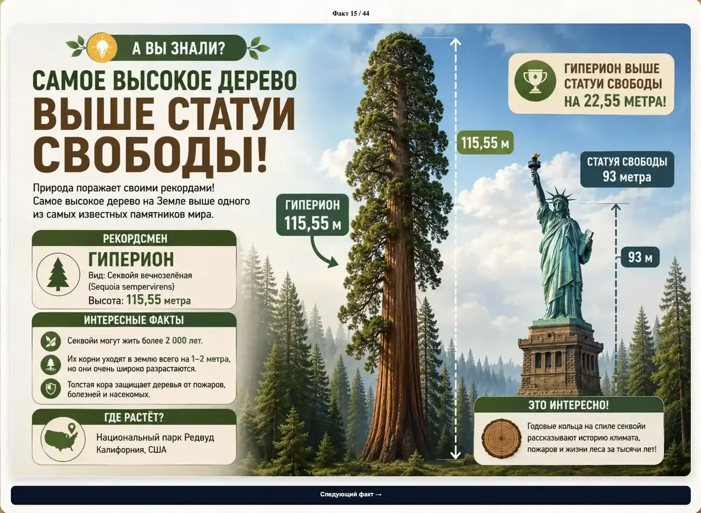
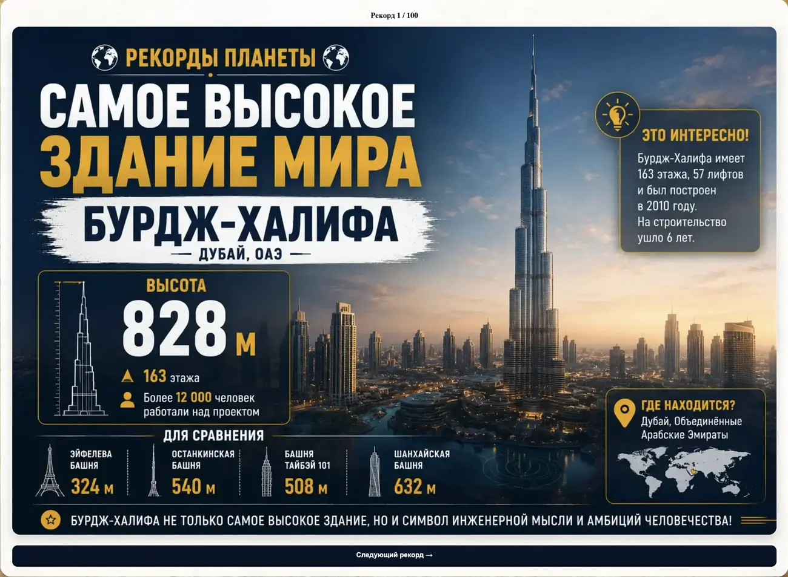
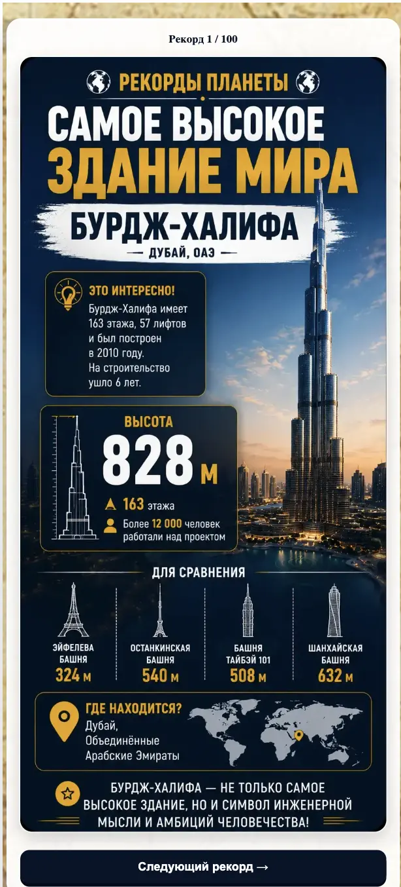

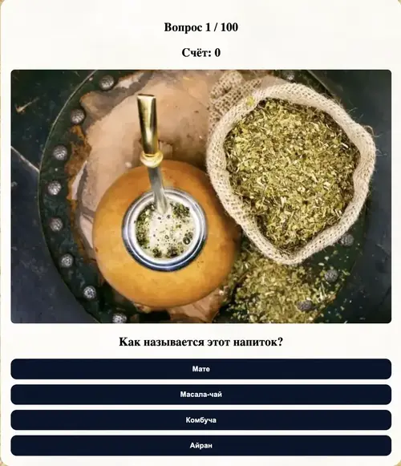

##  Technologies

This project is built with:

* React
* React Router
* JavaScript
* CSS Modules
* Luxon
* D3-Geo
* TopoJSON
* React Select

Additional features:

* LocalStorage
* Lazy Loading
* Service Worker
* PWA Support
* Offline Mode

Deployment:

* GitHub Pages
* GitHub Actions

---

## 📊 Current Scale

At the moment Global Timeboard includes:

* 🌍 190+ countries
* 🚩 190+ flags
* 🏛️ 190+ capitals
* 💰 world currencies database
* 🗿 3000+ landmarks
* 🍽️ 150 traditional dishes from around the world
* 🍹 100 traditional drinks from around the world
* 🌶️ 44 extreme cuisine challenges
* 🌌 100 World & Universe Records cards (mobile-optimized)
* 💡 40 "Did You Know?" fact cards
* ❓ 1,100+ geography & culture questions
* 🎮 8 quiz modes
* 🏆 achievement system
* 📱 PWA support
* 🌐 offline mode

The project is actively growing with new countries, landmarks, facts and educational content.

---

##  Project Goal

Global Timeboard started as a world clock application and gradually evolved into a geography learning platform.

The goal of the project is to combine world time, maps, countries, landmarks and quizzes in a single educational application.

The project is actively developed and new content is added regularly.

---

##  Roadmap

✅ World Clocks

✅ Country Encyclopedia

✅ Flags Quiz

✅ Capitals Quiz

✅ Currency Quiz

✅ Landmarks Quiz

✅ Achievement Hall

✅ PWA Support

✅ Offline Mode

🔄 Expanding Country Content

🔄 Adding New Landmarks

🔄 More Educational Content

## Author

Created by **Ilya Duzhakov**.

© 2026 Global Timeboard. All rights reserved.
